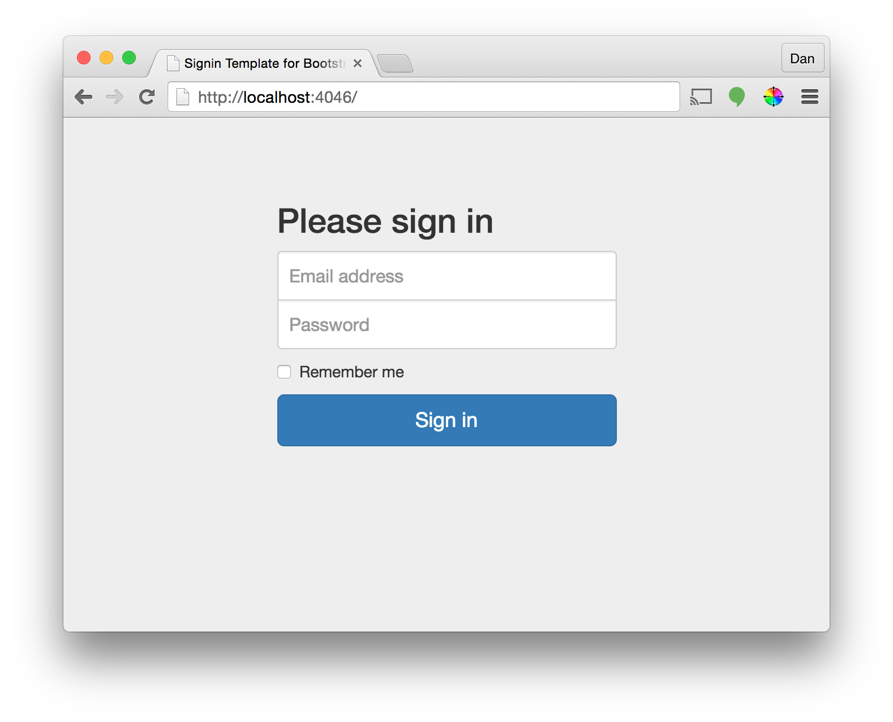
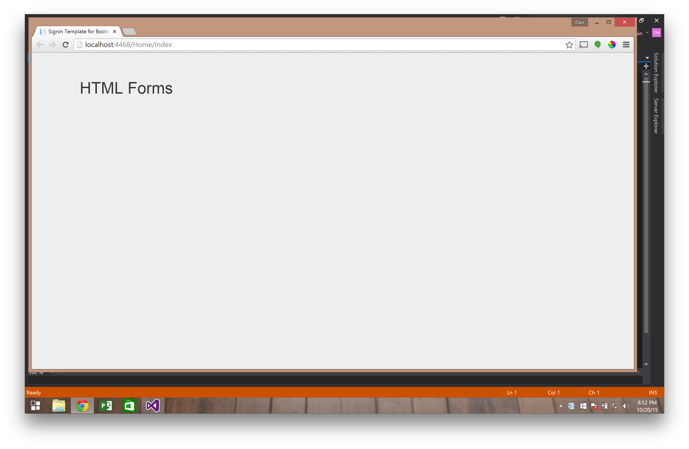
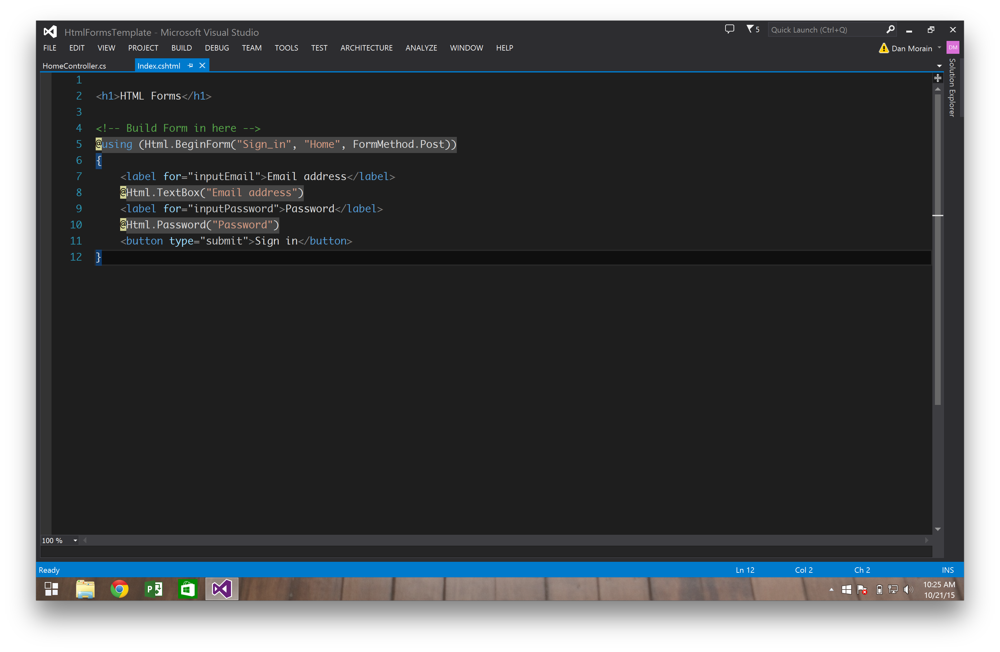
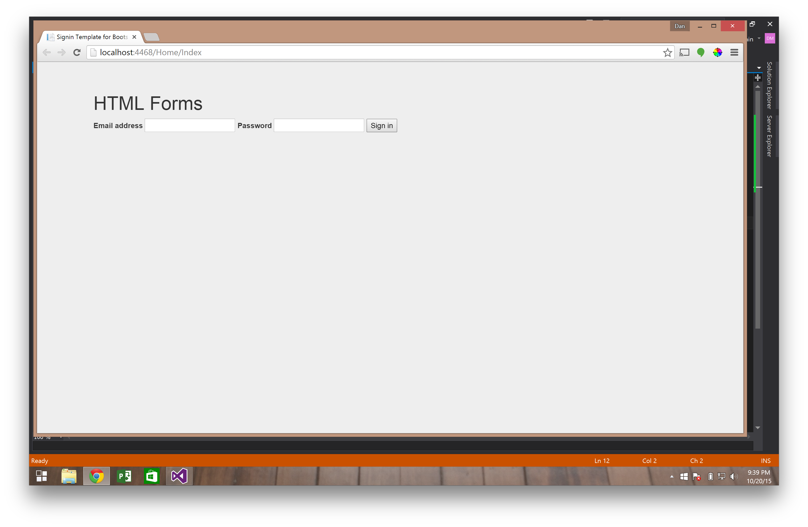
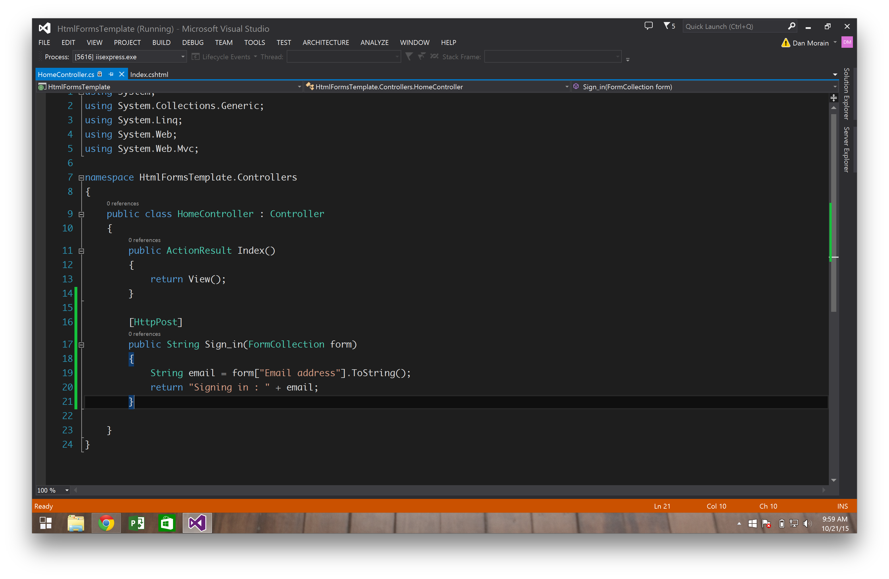
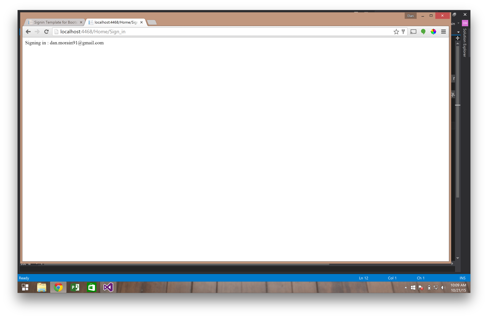

# .NET HTML Forms

This tutorial about HTML forms will take less than 30 minutes

## Introduction

**This is what a form looks like in HTML**  


```html
<form action="/Home/Sign_in" method="POST">
	<input name="email" type="email" />
	<input name="password" type="password" />
	<input type="submit" value="Sign in" />
</form>
```


Form Component | Description
-------------- | -----------
Action         | Tells the browser where to send the information the user enters into the form
Method         | GET or POST
Input          | Create form compontents (text box, button)
GET            | Requests data from a specified resource
POST           | Submits data to be processed to a specified resource


**We build forms in .NET using the Html form helper class**


```
@using (Html.BeginForm("Sign_in", "Home", FormMethod.Post))
{
    @Html.TextBox("Email address")
    @Html.Password("Password")
    <button type="submit">Sign in</button>
}
```
We are building a view that displays a sign in form to the user and submits the form data to the Sign_in action in the Home Controller



## Getting Started

### Download Starter Code

- You can download this project by clicking the download "Download ZIP" button on the right side of this page
- Run the project and make sure it displays an empty view for us to build our form in



### View: Build form with HTML Helper

Add this code to your index.cshtml file

```
@using (Html.BeginForm("Sign_in", "Home", FormMethod.Post))
{
    <label for="inputEmail">Email address</label>
    @Html.TextBox("Email address")
    <label for="inputPassword">Password</label>
    @Html.Password("Password")
    <button type="submit">Sign in</button>
}
```



Your view should now show an ugly form for the user to input an email address and password



Before this form will work we need to create an action method in our Home Controller to receive this request

### Controller: Create Sign_in Action method

**Add a method to your Home Controller called Sign_in.**  We use the `[HttpPost]` annotation to specify that this method is receiving data

``` csharp
[HttpPost]
public String Sign_in(FormCollection form)
{
    String email = form["Email address"].ToString();
    return "Signing in : " + email; 
}
```



Submitting the form passes the form data to the Sign_in action.  We retreived the email address from the form and returned a string to give feedback to the user.



### Make it pretty: Add html attributes to form

You can add html attributes to the form by passing an object to the Html helper's constructor

```
Html.BeginForm("Action Name", "Controller Name", new { @class = "form-signin" })
```

*NOTE:* to pass class names you must use @class, because class is a reserved word


```
@using (Html.BeginForm("Sign_in", "Home", FormMethod.Post, new { @class = "form-signin" }))
{
    <h2 class="form-signin-heading">Please sign in</h2>
    <label for="inputEmail" class="sr-only">Email address</label>
    @Html.TextBox("Email address", "", new { type = "email", id = "inputEmail", @class = "form-control", placeholder = "Email address", required = true, autofocus = true })
    <label for="inputPassword" class="sr-only">Password</label>
    @Html.Password("Password", "", new { type = "password", id = "inputPassword", @class = "form-control", placeholder = "Password", required = true})
    <button class="btn btn-lg btn-primary btn-block" type="submit">Sign in</button>
}
```
### Done!


